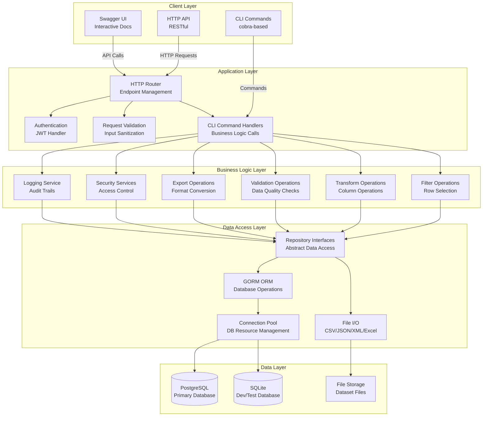
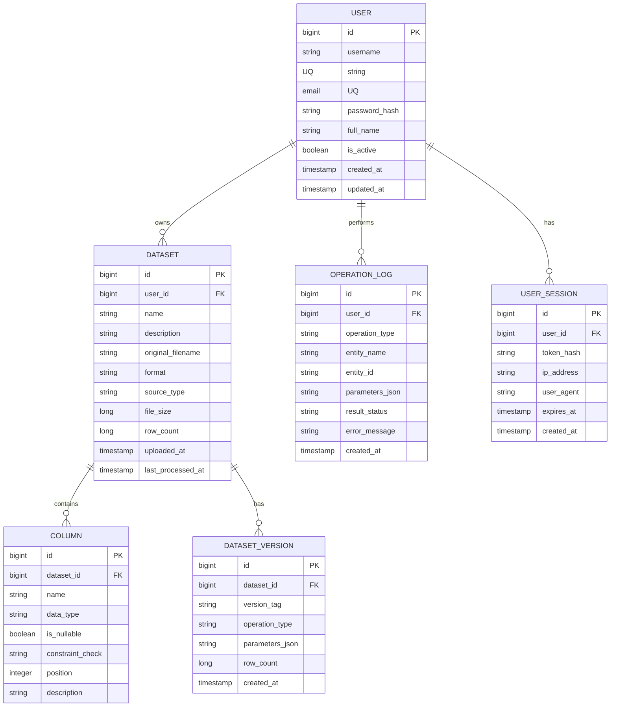
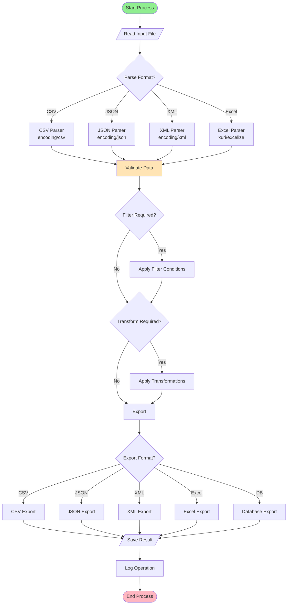
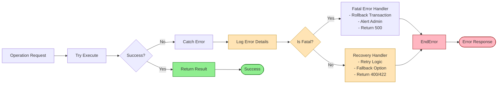
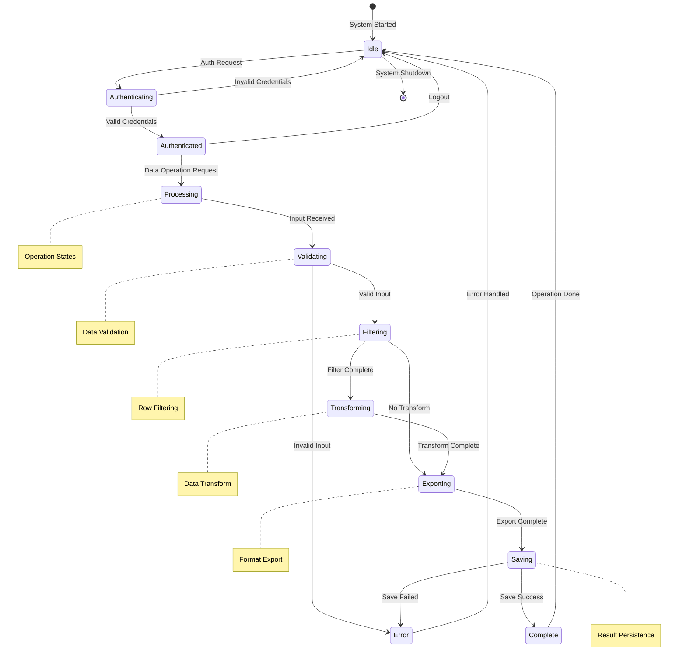
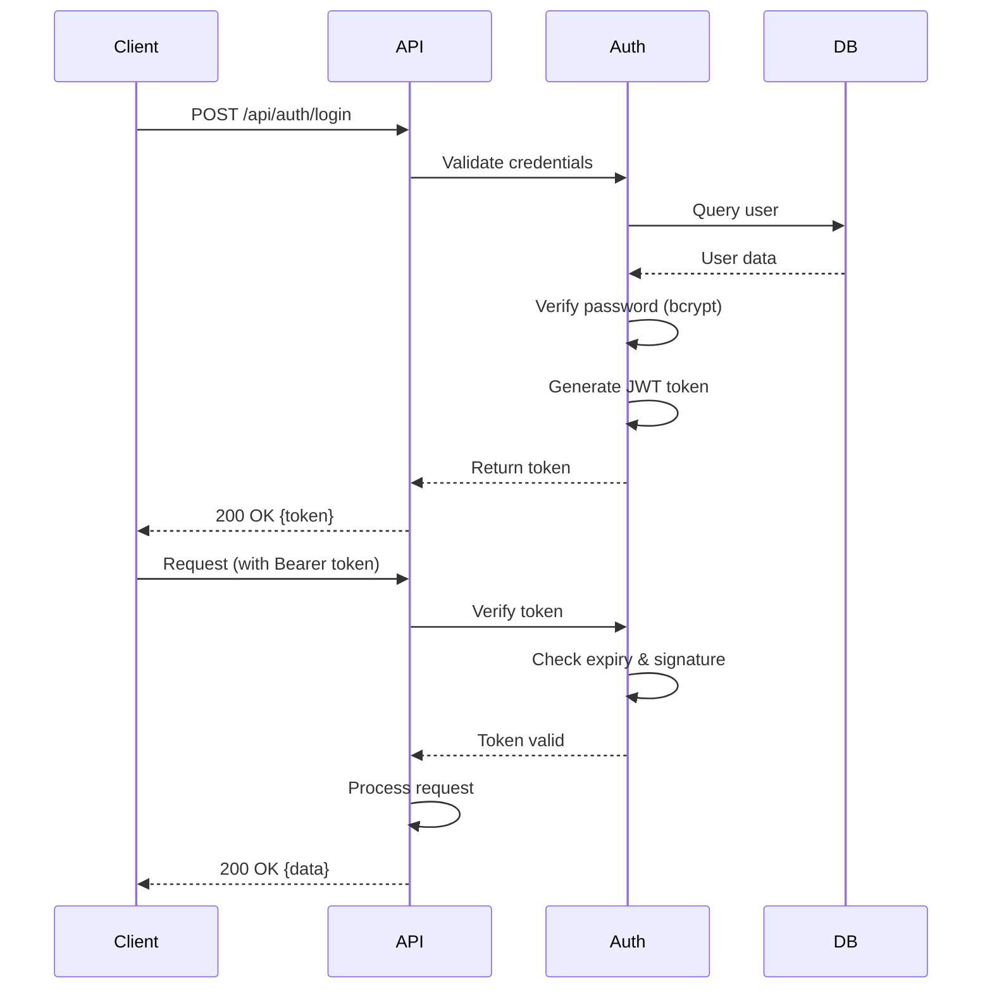
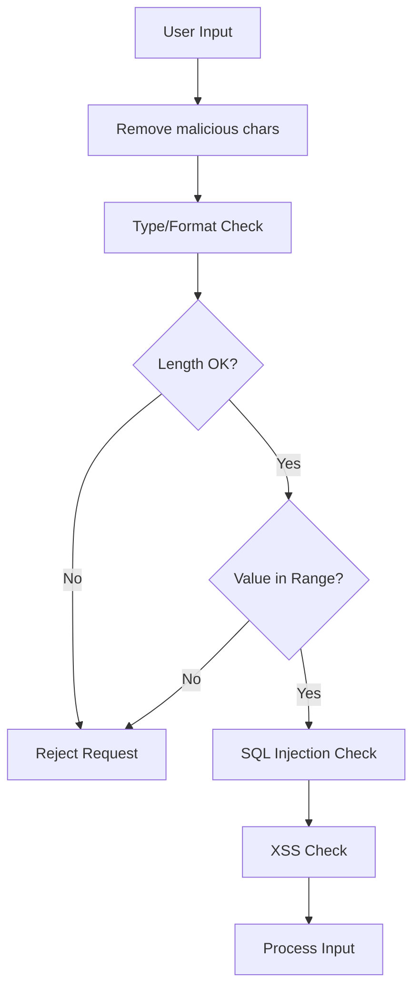

# Chapter 5: System Design & Implementation

## 5.1 System Design & Methodology

### Overview
The DataUtil system follows a **modular, layered architecture** designed for processing, transforming, and validating datasets across multiple formats (CSV, JSON, XML, Excel). The system employs a **microservices-friendly** design pattern with clear separation of concerns between CLI operations, HTTP API services, and data persistence layers.

### Architecture Pattern
```

                        Client Layer                           
  (CLI Commands / HTTP API Clients / Swagger UI)               

                     
                     

                  Application Layer                           
  • Cobra CLI Framework                                       
  • HTTP Server (RESTful API)                                
  • Authentication & Authorization (JWT)                     
  • Request Validation & Processing                          

                     
                     

                  Business Logic Layer                         
  • Data Operations (Filter, Transform, Validate, Export)    
  • Workflow Orchestration                                   
  • Error Handling & Logging                                 
  • Security Services                                        

                     
                     

                  Data Access Layer                            
  • Repository Pattern                                       
  • GORM ORM (Database Operations)                           
  • File I/O Operations                                      
  • Connection Pooling                                       

                     
                     

                  Data Layer                                  
  • PostgreSQL (Primary Database)                            
  • SQLite (Development/Testing)                             
  • File Storage (CSV, JSON, XML, Excel)                     

```

### Methodology

#### 1. **Domain-Driven Design (DDD)**
- Clear bounded contexts: `auth`, `operations`, `data`, `db`, `models`
- Each package encapsulates specific business capabilities
- Interfaces define contracts between layers

#### 2. **Clean Architecture Principles**
- Dependency rule: Inner layers don't depend on outer layers
- Core business logic independent of frameworks
- Easy to test and maintain

#### 3. **CQRS Pattern (Command Query Responsibility Segregation)**
- Write operations (import, transform, update) separated from read operations (filter, query, export)
- Optimizes performance and scalability

#### 4. **Repository Pattern**
- Abstracts data access logic
- Provides testability with mock implementations
- Decouples business logic from persistence details

### Design Decisions

| Decision | Rationale | Benefit |
|----------|-----------|---------|
| Go Language | Performance, concurrency, static typing | High-throughput data processing |
| Cobra CLI | Industry-standard, extensible | Consistent CLI experience |
| GORM ORM | Supports multiple databases, migrations | Database flexibility |
| JWT Authentication | Stateless, scalable | No server-side session storage |
| Viper Config | Multi-format, environment override | Flexible deployment |
| Layered Architecture | Separation of concerns | Maintainability & testability |

### Mermaid Diagram: System Architecture


---

## 5.2 Database Design / Data Structure Design

### Database Schema Design

#### Entity-Relationship Diagram


### Data Structure Design

#### 1. **Core Data Structures (Go Structs)**

```go
// User Model
type User struct {
    ID        uint      `gorm:"primaryKey"`
    Username  string    `gorm:"uniqueIndex;not null"`
    Email     string    `gorm:"uniqueIndex;not null"`
    Password  string    `gorm:"not null"`
    IsActive  bool      `gorm:"default:true"`
    CreatedAt time.Time
    UpdatedAt time.Time
}

// Dataset Model
type Dataset struct {
    ID             uint      `gorm:"primaryKey"`
    UserID         uint      `gorm:"index"`
    Name           string    `gorm:"not null"`
    Description    string
    OriginalFile   string    `gorm:"not null"`
    Format         string    `gorm:"not null"` // csv, json, xml, excel
    RowCount       int64
    FileSize       int64
    ProcessingMeta JSON      `gorm:"type:jsonb"`
    CreatedAt      time.Time
}

// DataRow - Generic row structure
type DataRow struct {
    RowIndex int                    `json:"row_index"`
    Values   map[string]interface{} `json:"values"`
    IsValid  bool                   `json:"is_valid"`
    Errors   []string               `json:"errors,omitempty"`
}

// FilterCondition
type FilterCondition struct {
    Column    string      `json:"column"`
    Operator  string      `json:"operator"` // >, <, ==, !=, contains, regex
    Value     interface{} `json:"value"`
    Logic     string      `json:"logic"` // AND, OR
}

// TransformOperation
type TransformOperation struct {
    Type       string      `json:"type"` // add, update, delete, rename
    Target     string      `json:"target"`
    Expression string      `json:"expression,omitempty"`
    Value      interface{} `json:"value,omitempty"`
}

// ValidationRule
type ValidationRule struct {
    Column     string   `json:"column"`
    Required   bool     `json:"required"`
    DataType   string   `json:"data_type"`
    MinLength  *int     `json:"min_length,omitempty"`
    MaxLength  *int     `json:"max_length,omitempty"`
    Pattern    string   `json:"pattern,omitempty"`
    EnumValues []string `json:"enum_values,omitempty"`
}
```

#### 2. **Process Design - Data Flow**


#### 3. **Circuit Design - Error Handling Flow**


### Index Strategy

| Table | Column(s) | Type | Purpose |
|-------|-----------|------|---------|
| users | username | UNIQUE | Fast user lookup |
| users | email | UNIQUE | Email-based auth |
| user_session | user_id, expires_at | INDEX | Session cleanup |
| dataset | user_id, created_at | INDEX | User dataset listing |
| operation_log | user_id, created_at | INDEX | Audit trail queries |
| column | dataset_id | INDEX | Column retrieval |

### Data Retention Policy
- Active datasets: Retained indefinitely
- Operation logs: Retained for 1 year
- User sessions: Retained for 30 days
- Deleted datasets: Soft delete (is_deleted flag), hard delete after 90 days

---

## 5.3 Input / Output and Interface Design

### 5.3.1 Input Specifications

#### CLI Input Format
```bash
# Filter Command
./datautil filter --input dataset.csv --where "age > 25 AND city = 'NYC'" --output filtered.csv

# Transform Command
./datautil transform --input data.csv --add "full_name=first_name+' '+last_name" --output transformed.csv

# Validate Command
./datautil validate --input file.csv --required "name,email" --types "string,email" --output report.json

# Export Command
./datautil export --input data.csv --to json --output data.json
```

#### API Input Format (JSON)
```json
{
  "input": "dataset.csv",
  "parameters": {
    "filter": {
      "conditions": [
        {
          "column": "age",
          "operator": ">",
          "value": 25
        }
      ]
    },
    "transform": [
      {
        "type": "add",
        "target": "full_name",
        "expression": "first_name + ' ' + last_name"
      }
    ]
  },
  "output_format": "csv",
  "output_path": "result.csv"
}
```

### 5.3.2 Output Specifications

#### CLI Output Format
```
✓ Operation completed successfully
  Input:  data.csv (1000 rows)
  Output: filtered.csv (850 rows)
  Time:   2.3s
  Rows processed: 1000
  Rows affected: 850
  Errors: 0
```

#### API Response Format
```json
{
  "status": "success",
  "message": "Operation completed successfully",
  "data": {
    "output_file": "result.csv",
    "rows_processed": 1000,
    "rows_affected": 850,
    "processing_time_ms": 2300,
    "errors": []
  },
  "metadata": {
    "request_id": "req_123456",
    "timestamp": "2026-04-27T12:00:00Z",
    "version": "1.0.0"
  }
}
```

### 5.3.3 Error Response Format
```json
{
  "status": "error",
  "message": "Validation failed",
  "error": {
    "code": "VALIDATION_ERROR",
    "details": [
      {
        "field": "email",
        "message": "Invalid email format",
        "row": 42
      }
    ]
  },
  "metadata": {
    "request_id": "req_123457",
    "timestamp": "2026-04-27T12:00:01Z"
  }
}
```

### 5.3.4 Interface Components

#### CLI Interface Components
1. **Flags & Options**
   - Global: `--config`, `--verbose`, `--output`
   - Auth: `--token`, `--username`, `--password`
   - Data: `--input`, `--where`, `--add`, `--validate`

2. **Interactive Prompts**
   - Password input (hidden)
   - Confirmation for destructive operations
   - Progress bars for long operations

3. **Help System**
   - Auto-generated from cobra commands
   - Examples for each command
   - Flag descriptions

#### HTTP API Interface
- **Base URL**: `http://localhost:8080/api`
- **Content-Type**: `application/json`
- **Authentication**: `Bearer <token>` header
- **Swagger UI**: `http://localhost:8080/swagger`

### 5.3.5 State Transition Diagram


---

## 5.3.2 Samples of Forms, Reports and Interface

### CLI Interface Samples

#### 1. Login Form (Interactive)
```
$ ./datautil login

  DataUtil CLI - Authentication
═══════════════════════════════════

  Email: admin@example.com
  Password: ********
  
  [Login] [Cancel]

→ Logging in...
✓ Authentication successful
  Token: eyJhbGc... (expires in 24h)
  User:  Admin User
```

#### 2. Data Filter Form
```
$ ./datautil filter --help

Filter dataset rows based on conditions

Usage:
  datautil filter [flags]

Flags:
  -i, --input string       Input file path (required)
  -w, --where string       Filter condition (e.g., "age > 25")
  -o, --output string      Output file path
  -f, --format string      Output format (csv, json, xml, excel)
  -l, --limit int          Maximum rows to return
  -h, --help               Help for filter

Examples:
  # Filter by age
  datautil filter --input data.csv --where "age > 25"
  
  # Filter by multiple conditions
  datautil filter --input data.csv --where "age > 25 AND city = 'NYC'"
  
  # Filter with regex
  datautil filter --input data.csv --where "email CONTAINS '@gmail.com'"
```

#### 3. Operation Report Sample
```
══════════════════════════════════════════════════════════
              DATAUTIL - OPERATION REPORT
══════════════════════════════════════════════════════════

Operation: FILTER
Date: 2026-04-27 12:00:00
User: admin@example.com

INPUT FILE:
  Path: /data/input.csv
  Size: 2.5 MB
  Rows: 10,000
  Columns: 12

FILTER CONDITIONS:
  ├─ age > 25
  ├─ status = 'active'
  └─ country IN ('USA', 'CANADA')

OUTPUT:
  Path: /data/output.csv
  Size: 1.8 MB
  Rows: 6,234 (62.34%)
  Columns: 12

PROCESSING:
  Duration: 1.45s
  Rows/sec: 6,896
  Memory: 45.2 MB
  Threads: 4

══════════════════════════════════════════════════════════
```

### HTTP API Interface Samples

#### 1. API Endpoint: Filter Data
```http
POST /api/data/filter
Authorization: Bearer eyJhbGc...
Content-Type: application/json

{
  "input": "dataset.csv",
  "filter": {
    "conditions": [
      {
        "column": "age",
        "operator": ">",
        "value": 25
      },
      {
        "column": "status",
        "operator": "=",
        "value": "active"
      }
    ],
    "logic": "AND"
  },
  "output_format": "csv"
}
```

#### 2. API Response
```json
{
  "status": "success",
  "message": "Filter operation completed",
  "data": {
    "output_file": "filtered_dataset_20260427.csv",
    "download_url": "/api/files/download/filtered_dataset_20260427.csv",
    "rows_processed": 10000,
    "rows_returned": 6234,
    "processing_time_ms": 1450
  },
  "metadata": {
    "request_id": "req_abc123",
    "timestamp": "2026-04-27T12:00:00Z",
    "version": "1.0.0"
  }
}
```

### Web Interface (Swagger UI)
```
Swagger Documentation
├─ /api/health
│  └─ GET Health check endpoint
├─ /api/auth/register
│  └─ POST Register new user
├─ /api/auth/login
│  └─ POST Authenticate and get token
├─ /api/data/filter
│  └─ POST Filter dataset rows
├─ /api/data/transform
│  └─ POST Transform dataset
├─ /api/data/validate
│  └─ POST Validate dataset
├─ /api/data/export
│  └─ POST Export dataset
└─ /api/db/query
   └─ POST Execute SQL query
```

---

## 5.3.3 Access Control / Mechanism / Security

### Authentication Flow


### Authorization Matrix

| Role | Read Data | Write Data | Filter | Transform | Validate | Export | Manage Users | System Config |
|------|----------|-----------|--------|-----------|----------|--------|--------------|---------------|
| Guest | ✓ | ✗ | ✗ | ✗ | ✗ | ✗ | ✗ | ✗ |
| User | ✓ | ✓ | ✓ | ✓ | ✓ | ✓ | ✗ | ✗ |
| Admin | ✓ | ✓ | ✓ | ✓ | ✓ | ✓ | ✓ | Limited |
| SuperAdmin | ✓ | ✓ | ✓ | ✓ | ✓ | ✓ | ✓ | ✓ |

### Security Implementation

#### 1. **JWT Token Structure**
```json
{
  "header": {
    "alg": "HS256",
    "typ": "JWT"
  },
  "payload": {
    "sub": "user-id",
    "username": "admin",
    "role": "admin",
    "permissions": ["read", "write", "delete"],
    "iat": 1651036800,
    "exp": 1651123200,
    "jti": "unique-token-id"
  },
  "signature": "HMACSHA256(base64UrlEncode(header)+'.'+base64UrlEncode(payload), secret)"
}
```

#### 2. **Password Security**
- Algorithm: bcrypt (cost factor: 12)
- Minimum length: 8 characters
- Requirements: uppercase, lowercase, number, special character
- Storage: hashed only (never plaintext)

#### 3. **API Rate Limiting**
```go
type RateLimiter struct {
    RequestsPerMinute int
    BurstSize        int
    Enabled          bool
}

// Default limits
{
    "guest":  {"rpm": 60, "burst": 10},
    "user":   {"rpm": 300, "burst": 50},
    "admin":  {"rpm": 1000, "burst": 100},
}
```

#### 4. **Input Validation & Sanitization**


### Security Features

#### **Data Encryption**
- **At Rest**: AES-256 encryption for sensitive fields
- **In Transit**: TLS 1.3 for all API communications
- **Key Management**: Environment variables + KMS integration

#### **Audit Logging**
```go
type AuditLog struct {
    Timestamp   time.Time `json:"timestamp"`
    UserID      uint      `json:"user_id"`
    Action      string    `json:"action"`
    Resource    string    `json:"resource"`
    Status      string    `json:"status"`
    IPAddress   string    `json:"ip_address"`
    UserAgent   string    `json:"user_agent"`
    RequestID   string    `json:"request_id"`
}
```

#### **Session Management**
- Token expiry: 24 hours (configurable)
- Refresh token: 7 days
- Concurrent sessions: Maximum 5
- Auto-logout: 30 minutes inactivity
- Token revocation: Immediate on logout

#### **Security Headers**
```
HTTP/1.1 200 OK
Content-Security-Policy: default-src 'self'
X-Frame-Options: DENY
X-Content-Type-Options: nosniff
Strict-Transport-Security: max-age=31536000; includeSubDomains
X-XSS-Protection: 1; mode=block
Referrer-Policy: strict-origin-when-cross-origin
```

### Access Control Implementation

#### **Role-Based Access Control (RBAC)**
```go
type Permission string

const (
    PermissionReadData   Permission = "data:read"
    PermissionWriteData  Permission = "data:write"
    PermissionDeleteData Permission = "data:delete"
    PermissionManageUser Permission = "user:manage"
    PermissionSystemAdmin Permission = "system:admin"
)

type Role struct {
    Name        string        `json:"name"`
    Permissions []Permission  `json:"permissions"`
}

// Role definitions
var Roles = map[string]Role{
    "guest": {
        Name:        "Guest",
        Permissions: []Permission{PermissionReadData},
    },
    "user": {
        Name:        "User",
        Permissions: []Permission{
            PermissionReadData,
            PermissionWriteData,
        },
    },
    "admin": {
        Name:        "Admin",
        Permissions: []Permission{
            PermissionReadData,
            PermissionWriteData,
            PermissionDeleteData,
            PermissionManageUser,
        },
    },
    "superadmin": {
        Name:        "Super Admin",
        Permissions: []Permission{
            PermissionReadData,
            PermissionWriteData,
            PermissionDeleteData,
            PermissionManageUser,
            PermissionSystemAdmin,
        },
    },
}
```

#### **Middleware for Authorization**
```go
func RequirePermission(permission string) gin.HandlerFunc {
    return func(c *gin.Context) {
        user := c.MustGet("user").(*User)
        
        if !user.HasPermission(permission) {
            c.JSON(403, gin.H{
                "error": "insufficient_permissions",
                "message": "You don't have permission to perform this action",
            })
            c.Abort()
            return
        }
        
        c.Next()
    }
}
```

### Security Monitoring

#### **Real-time Alerts**
- Failed login attempts (>5 in 5 minutes)
- Unusual access patterns (geographic anomalies)
- Privilege escalation attempts
- Data exfiltration patterns (bulk exports)
- Brute force detection

#### **Compliance**
- GDPR compliant data handling
- Right to erasure implementation
- Data portability features
- Consent management
- Data retention policies

### Vulnerability Protection

| Threat | Mitigation |
|--------|-----------|
| SQL Injection | Parameterized queries, ORM |
| XSS Attacks | Input sanitization, output encoding |
| CSRF | SameSite cookies, anti-CSRF tokens |
| Brute Force | Rate limiting, account lockout |
| DDoS | Rate limiting, CDN, WAF |
| MITM | TLS 1.3, HSTS enforcement |
| IDOR | UUID resource IDs, access checks |
| Token Theft | Short expiry, refresh tokens, HttpOnly cookies |